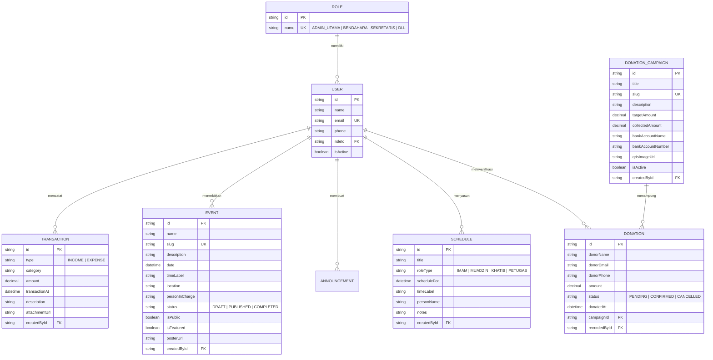

# 02 — Clean Architecture & Entity Relationship Diagram (ERD)

---

## 1. Arsitektur Tiga Lapisan (Clean Architecture Blueprint)

Untuk mengatasi tight coupling dan menyederhanakan pemeliharaan jangka panjang, sistem memisahkan tanggung jawab menjadi 3 lapisan:

```
+-------------------------------------------------------------+
|                1. PRESENTATION LAYER (UI)                   |
|  - Server & Client Components (Next.js 16 App Router)       |
|  - Atomic Design Components (Button, CurrencyInput, etc.)   |
|  - Table & Modal Controls                                   |
+------------------------------+------------------------------+
                               |
+------------------------------v------------------------------+
|             2. DOMAIN & APPLICATION LOGIC LAYER             |
|  - Domain Validation (Zod Schemas)                          |
|  - Custom Client Hooks (useCashTransaction, useDraft)       |
|  - Domain Services (Business calculations & sanitization)   |
|  - RBAC Guard & Permission Check                            |
+------------------------------+------------------------------+
                               |
+------------------------------v------------------------------+
|                3. DATA ACCESS LAYER (DAL)                   |
|  - Repository Interfaces (ITransactionRepository, etc.)     |
|  - Prisma Client ORM Implementations                        |
|  - Cache Tag Revalidation Strategy                          |
+-------------------------------------------------------------+
```

### Aturan Ketergantungan (Dependency Rule)
1. **Presentation Layer** tidak boleh mengimpor Prisma Client secara langsung.
2. **Server Actions** bertindak sebagai perantara tipis (transport layer) yang memanggil Service, bukan tempat menaruh query database mentah.
3. **Repository** bertanggung jawab atas persistensi data, transaksi atomik, dan query agregasi.

---

## 2. Diagram Relasi Entitas (ERD)



