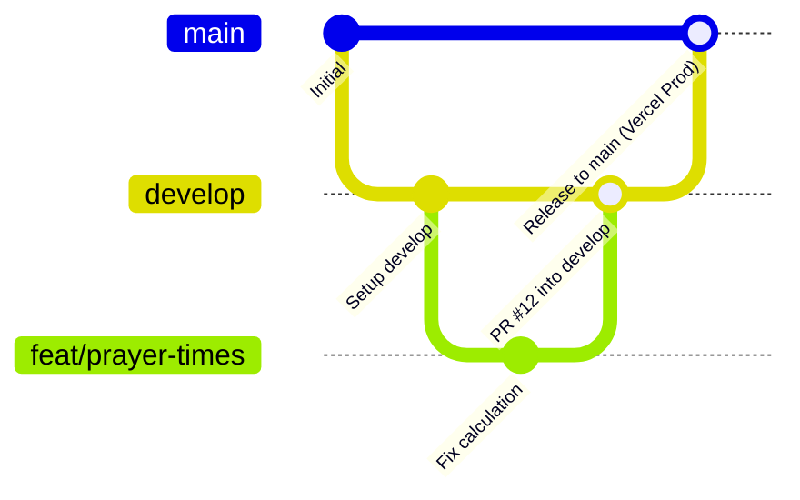

# Standarisasi Git Branching & Workflow Portal Masjid Nurul Jannah

Dokumen ini adalah acuan resmi standarisasi cabang (*branching model*), tata kelola commit, dan alur rilis produksi portal web dan CMS Masjid Nurul Jannah.

---

## 1. Arsitektur Cabang Utama (*Core Branches*)



| Branch | Lingkungan (*Target*) | Kebijakan & Aturan Akses |
| :--- | :--- | :--- |
| **`main`** | **Produksi** (`masjidnuruljannah.vercel.app`) | **Protected**. Tidak boleh push langsung. Hanya menerima merge dari `develop` (via release PR) atau `hotfix/*`. Setiap push otomatis memicu build Vercel Production & CI quality gate. |
| **`develop`** | **Staging / Integrasi** | Cabang aktif tempat berkumpulnya seluruh fitur dan perbaikan yang telah diverifikasi sebelum digabungkan ke `main`. |

---

## 2. Cabang Kerja Sementara (*Supporting Branches*)

### A. Feature Branch (`feat/*`)
- **Tujuan**: Pengembangan fitur baru atau perombakan modul.
- **Dibuat dari**: `develop`
- **Target Merge**: `develop` (via Pull Request)
- **Format Penamaan**: `feat/<nama-fitur>`
  - Contoh: `feat/cms-beranda-tabs`, `feat/weekly-transparency-card`

### B. Bugfix Branch (`fix/*`)
- **Tujuan**: Perbaikan bug non-kritis selama sprint pengembangan.
- **Dibuat dari**: `develop`
- **Target Merge**: `develop`
  - Contoh: `fix/prayer-times-angles`, `fix/form-label-associations`

### C. Hotfix Branch (`hotfix/*`)
- **Tujuan**: Perbaikan darurat (*critical bug*) yang terjadi di server produksi (`main`).
- **Dibuat dari**: `main`
- **Target Merge**: `main` **DAN** `develop`
  - Contoh: `hotfix/auth-session-cookie`

---

## 3. Standarisasi Pesan Commit (Conventional Commits)

Format commit pesan:
```text
<tipe>(<cakupan>): <deskripsi singkat imperative>
```

- `feat`: Penambahan fitur baru (misal: `feat(cms): add quick rupiah increment buttons`)
- `fix`: Perbaikan bug (misal: `fix(prayer-times): normalize astronomical angles`)
- `refactor`: Refaktor kode tanpa mengubah fungsionalitas publik
- `perf`: Peningkatan kecepatan atau efisiensi build
- `ci`: Perubahan pada workflow GitHub Actions atau konfigurasi CI
- `chore`: Pembaruan dependensi atau konfigurasi tooling

---

## 4. Syarat Kelulusan CI Gate Sebelum Merge
Setiap Pull Request ke `develop` maupun `main` **wajib lolos 100% tanpa kompromi**:
1. **Linting**: `npm run lint` $
ightarrow$ **0 warning, 0 error** (tidak ada annotasi kuning/merah).
2. **Typecheck**: `npx tsc --noEmit` $
ightarrow$ **0 type errors**.
3. **Build**: `npm run build` $
ightarrow$ **Seluruh rute publik & dinamis sukses terkompilasi**.
